# ExcelAI Architecture

> This document describes the architecture implemented across the `ExcelAI` web application and the sibling `excel-mcp` service. The filename is intentionally `archutecture.md` as requested.

## 1. System overview

ExcelAI is a browser-based Next.js application deployed on Vercel. Its server-side API routes orchestrate Groq language models and a separate Excel Model Context Protocol (MCP) server deployed on Render. Supabase Storage is the shared file exchange layer between the two deployments. Upstash Redis is an optional cache used only by the Vercel application.

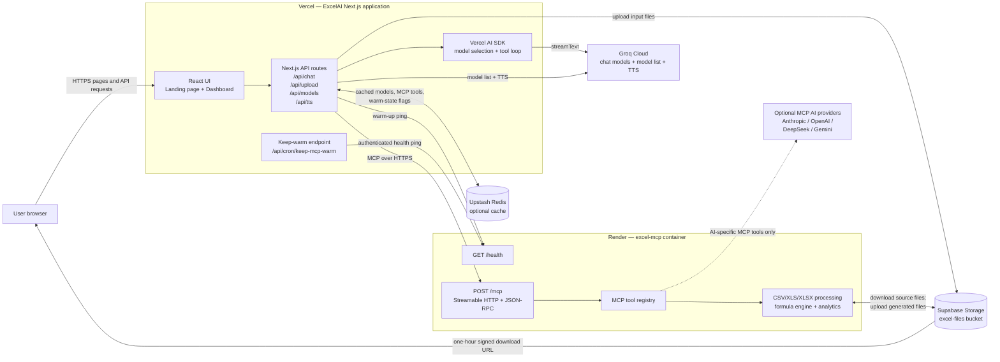

The main AI conversation is handled by Groq from Vercel. The optional AI providers inside `excel-mcp` are a second, independent AI layer used only when the model invokes the MCP service's AI-specific tools.

## 2. Deployment boundaries and responsibilities

### Browser

- Renders the landing page and the three dashboard workflows: Upload & Process, Create New, and AI Assistant.
- Uploads `.xlsx`, `.xls`, and `.csv` files to the Vercel `/api/upload` route.
- Sends chat messages, selected model ID, and uploaded Supabase object keys to `/api/chat`.
- Consumes the streamed AI response and renders reasoning, text, tool results, and file download cards.
- Optionally requests generated speech from `/api/tts` and plays the returned WAV audio.

### Vercel: `ExcelAI`

- Hosts the Next.js App Router frontend and server-side API routes.
- Keeps Groq and Supabase service-role credentials on the server.
- Selects a Groq model and runs the Vercel AI SDK tool-calling loop.
- Creates an HTTP MCP client for the Render service on each chat request.
- Uploads browser files directly to Supabase Storage.
- Caches Groq's model list, MCP tool definitions, and recent Render warm state in Upstash Redis when Redis is configured.
- Streams the final assistant response back to the browser.

### Render: `excel-mcp`

- Runs a Node 20 Docker container with an Express server.
- Exposes `GET /health` and `POST /mcp`.
- Implements stateful MCP Streamable HTTP sessions using the `mcp-session-id` header.
- Publishes 20 Excel tools across basic access, analytics, writing/export, formulas, and optional AI operations.
- Downloads source files from Supabase into the container's temporary directory when given a storage object key.
- Processes files using `xlsx`, `csv-parse`, and `csv-stringify`.
- Uploads generated files to Supabase and creates signed download URLs.

### Supabase

- Acts as shared object storage, not as the main application database.
- Uses the bucket from `SUPABASE_BUCKET`, defaulting to `excel-files`.
- Stores original uploads at keys such as `<timestamp>-<sanitized-name>`.
- Stores generated outputs under `generated/<timestamp>-<sanitized-name>`.
- Issues signed URLs for generated files with a one-hour lifetime.
- Both Vercel and Render use the service-role key server-side.

Although Supabase client/server helper files exist under `utils/supabase`, there is no root Next.js middleware in this repository and no active authentication flow wired into the pages or API routes. The current implemented Supabase dependency is primarily Storage.

### Upstash Redis

Redis is optional. If `KV_REST_API_URL` or `KV_REST_API_TOKEN` is absent, the application continues without distributed caching.

- `excelai:groq-models:v1`: filtered Groq model list; 24-hour TTL.
- `excelai:mcp-tools:v1`: MCP tool definitions; 24-hour TTL.
- `excelai:mcp-warm:v1`: recently successful Render health check; 5-minute TTL.

Redis does not store spreadsheets, chat history, or generated files.

## 3. Vercel application internals

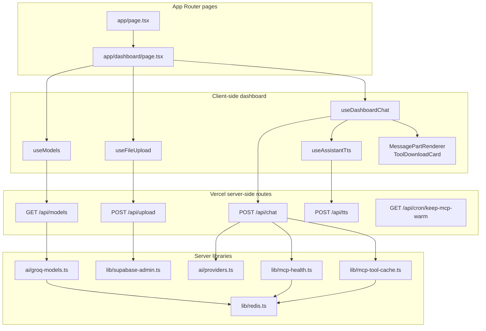

### API route map

- `GET /api/models`
  - Fetches available Groq models.
  - Removes known non-chat models.
  - Marks reasoning-capable and preferred models.
  - Uses process memory first, Redis second, and Groq's models API on a cache miss.

- `POST /api/upload`
  - Receives multipart form data.
  - Sanitizes each filename.
  - Uploads file bytes to Supabase Storage with `upsert: false`.
  - Returns storage object keys; it does not send the file to Render.

- `POST /api/chat`
  - Converts UI messages into model messages.
  - Checks or warms Render's health endpoint.
  - Opens an MCP HTTP client at `${RENDER_MCP_URL}/mcp`.
  - Reads MCP tool definitions from Redis or Render.
  - Combines the MCP tools with the UI-only `showAllExcelTools` tool.
  - Resolves the requested Groq model.
  - Streams up to five AI/tool steps back to the browser.
  - Closes the MCP client when generation finishes.

- `POST /api/tts`
  - Sends text to Groq's `canopylabs/orpheus-v1-english` model.
  - Returns `audio/wav`.

- `GET /api/cron/keep-mcp-warm`
  - Requires `Authorization: Bearer <CRON_SECRET>` or `x-cron-secret`.
  - Pings Render's `/health` endpoint with a 110-second timeout.
  - The endpoint exists, but the checked-in `vercel.json` does not define a cron schedule; an external scheduler or a Vercel cron configuration must call it.

## 4. Render MCP service internals

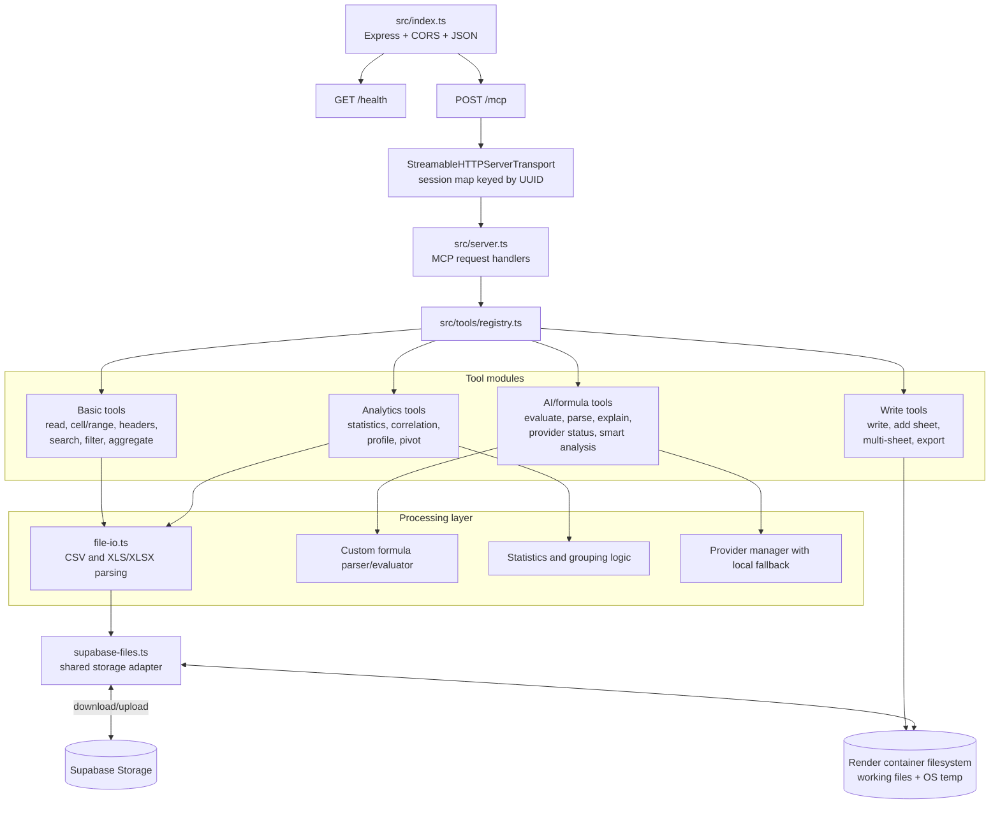

### MCP tool catalog

- Basic: `read_file`, `get_cell`, `get_range`, `get_headers`, `search`, `filter_rows`, `aggregate`.
- Analytics: `statistical_analysis`, `correlation_analysis`, `data_profile`, `pivot_table`.
- Write/export: `write_file`, `add_sheet`, `write_multi_sheet`, `export_analysis`.
- Formula/AI: `evaluate_formula`, `parse_natural_language`, `explain_formula`, `ai_provider_status`, `smart_data_analysis`.

The registry merges all definitions and dispatches each MCP `tools/call` request to its matching handler. Unknown tool names become MCP `MethodNotFound` errors; unhandled handler failures become MCP `InternalError` responses.

## 5. End-to-end flow diagrams

### 5.1 Upload and analyze an existing workbook

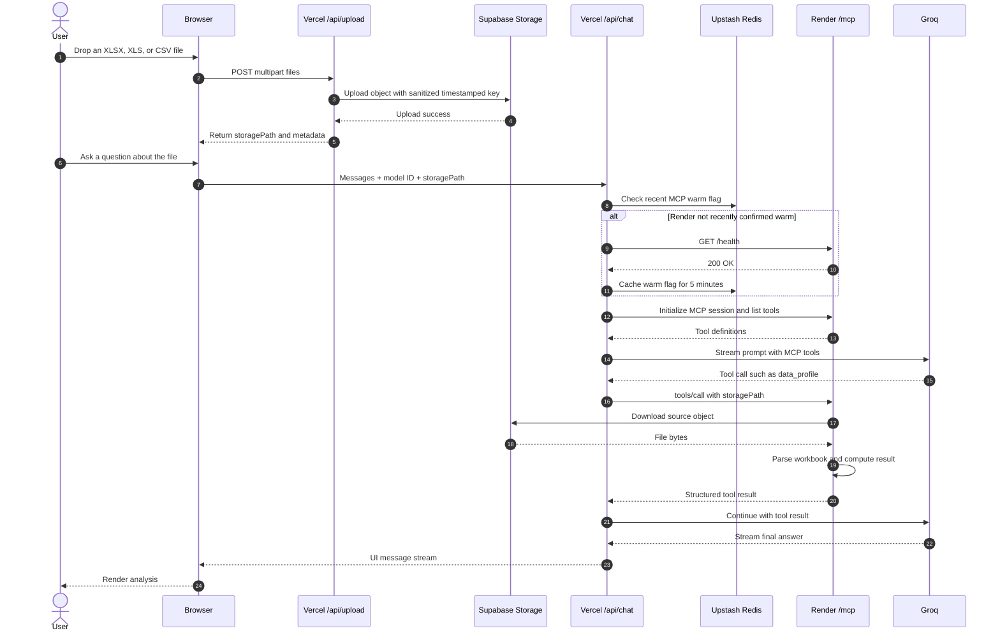

### 5.2 Create a new workbook and download it

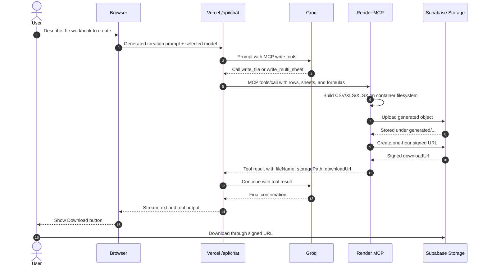

### 5.3 Groq model discovery and caching

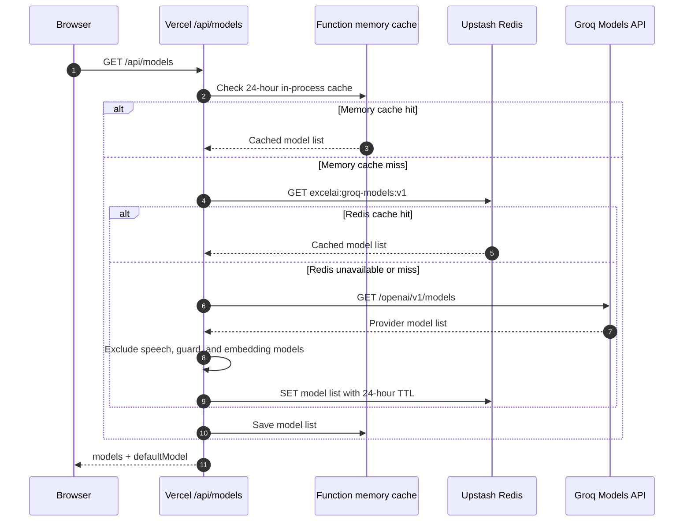

### 5.4 Chat orchestration and tool loop

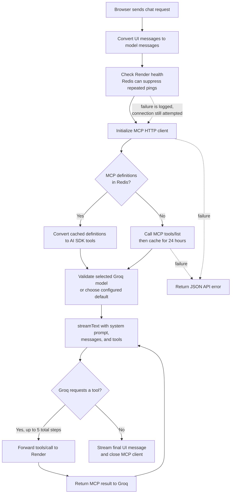

### 5.5 Text-to-speech

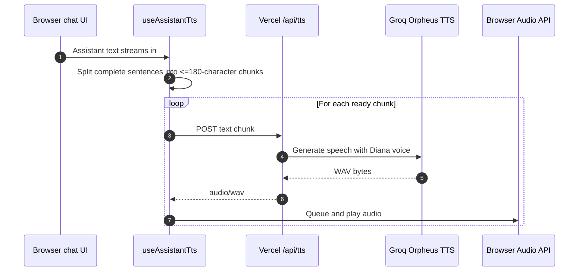

### 5.6 Keep-warm flow

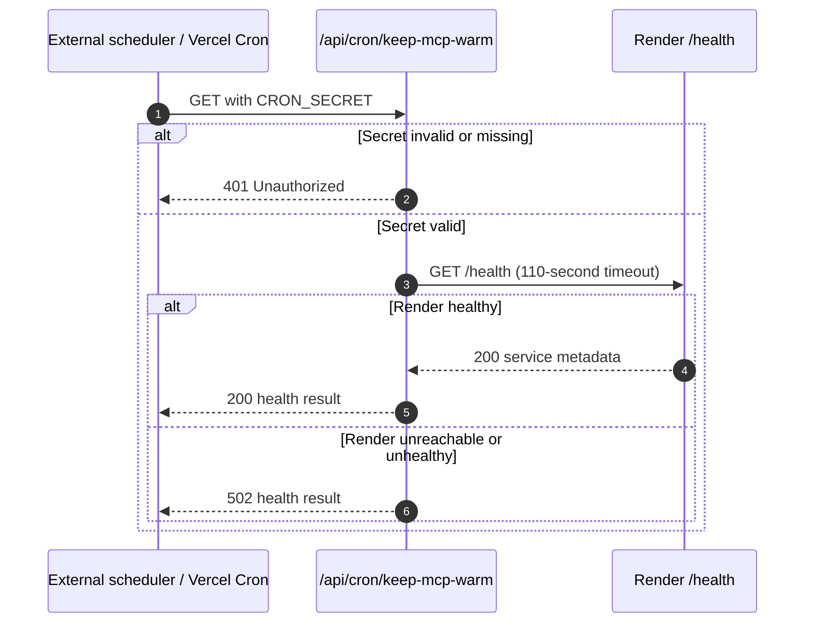

## 6. Shared file lifecycle

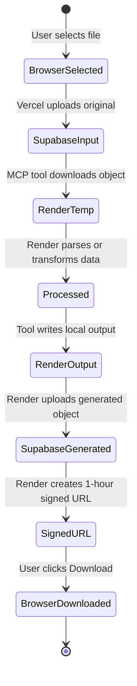

The Render filesystem is ephemeral and is used only as a processing workspace. Supabase object keys are the stable cross-service identifiers. Uploaded source files and generated files are not automatically deleted by the current code.

## 7. Environment variables by deployment

### Vercel / `ExcelAI`

- `GROQ_API_KEY`: Groq chat model discovery, generation, and TTS.
- `GROQ_DEFAULT_MODEL`: optional preferred default model.
- `RENDER_MCP_URL`: base URL of the Render MCP service.
- `KV_REST_API_URL`, `KV_REST_API_TOKEN`: optional Upstash Redis credentials.
- `NEXT_PUBLIC_SUPABASE_URL`: Supabase project URL.
- `SUPABASE_SERVICE_ROLE_KEY`: privileged server-side Storage access.
- `SUPABASE_BUCKET`: optional bucket override; defaults to `excel-files`.
- `NEXT_PUBLIC_SUPABASE_ANON_KEY`: referenced by currently unused Supabase browser/server helpers.
- `CRON_SECRET`: protects the keep-warm endpoint.

### Render / `excel-mcp`

- `PORT`: HTTP port; Docker defaults to `5050`.
- `SUPABASE_URL` or `NEXT_PUBLIC_SUPABASE_URL`: shared Supabase project URL.
- `SUPABASE_SERVICE_ROLE_KEY`: privileged Storage access.
- `SUPABASE_BUCKET`: must identify the same bucket used by Vercel.
- `ANTHROPIC_API_KEY`, `ANTHROPIC_MODEL`: optional MCP AI provider.
- `OPENAI_API_KEY`, `OPENAI_MODEL`, `OPENAI_BASE_URL`: optional MCP AI provider.
- `DEEPSEEK_API_KEY`, `DEEPSEEK_MODEL`, `DEEPSEEK_BASE_URL`: optional MCP AI provider.
- `GEMINI_API_KEY`, `GEMINI_MODEL`, `GEMINI_BASE_URL`: optional MCP AI provider.

No secret values should be committed. `SUPABASE_SERVICE_ROLE_KEY`, `GROQ_API_KEY`, provider API keys, Redis token, and `CRON_SECRET` must remain server-only.

## 8. Repository map

### `ExcelAI`

- `app/page.tsx`: public landing page.
- `app/dashboard/page.tsx`: client dashboard composition.
- `app/api/chat/route.ts`: core AI and MCP orchestration.
- `app/api/upload/route.ts`: direct-to-Supabase server upload.
- `app/api/models/route.ts`: Groq model discovery.
- `app/api/tts/route.ts`: Groq speech generation.
- `app/api/cron/keep-mcp-warm/route.ts`: protected Render health ping.
- `hooks/use-dashboard-chat.ts`: client chat transport and create-sheet workflow.
- `hooks/use-file-upload.ts`: drop-zone validation and upload.
- `hooks/use-assistant-tts.ts`: streamed text chunking and playback queue.
- `ai/groq-models.ts`: model filtering, defaults, and caching.
- `ai/providers.ts`: Groq language-model construction.
- `lib/mcp-health.ts`: Render health checks and warm cache.
- `lib/mcp-tool-cache.ts`: MCP definition cache.
- `lib/redis.ts`: optional Upstash client.
- `lib/supabase-admin.ts`: server-side Storage client.
- `components/message-part-renderer.tsx`: streamed message/tool rendering.
- `components/tool-download.tsx`: signed-URL download UI.
- `vercel.json`: Vercel build/function configuration.

### `excel-mcp`

- `src/index.ts`: Express entry point and HTTP routes.
- `src/server.ts`: MCP transport sessions and request handlers.
- `src/tools/registry.ts`: tool definition aggregation and dispatch.
- `src/tools/basic.ts`: file reading, range, search, filter, and aggregation.
- `src/tools/analytics.ts`: statistics, correlation, profiling, and pivots.
- `src/tools/write.ts`: file creation, multi-sheet workbooks, and exports.
- `src/tools/ai.ts`: formula and AI-assisted tools.
- `src/formula/*`: custom formula parsing, evaluation, and function library.
- `src/ai/*`: optional provider manager and natural-language processing.
- `src/supabase-files.ts`: object download/upload, signed URLs, and temp files.
- `src/utils/file-io.ts`: CSV and workbook parsing.
- `Dockerfile`: two-stage Node 20 production image with `/health` check.

## 9. Operational and security observations

These are properties of the current implementation, not additional components:

- The public chat and upload API routes do not enforce user authentication, rate limits, file-size limits, or per-user storage prefixes.
- The Render server enables unrestricted CORS and does not authenticate `/mcp`; network access or an application-level shared secret should protect it in production.
- MCP sessions are retained in an in-memory map without explicit cleanup, so long-running instances can accumulate stale transports.
- The Supabase service-role key is correctly used server-side, but its broad privileges make endpoint protection important.
- Redis failure is non-fatal; it increases Groq/Render requests but should not stop the application.
- Render health failure during chat is logged, but the application still attempts the MCP connection.
- `next.config.mjs` ignores TypeScript and ESLint build errors, which can allow defective builds to deploy.
- The landing page says data stays local and uses client-side processing, but the implemented flow sends files to Vercel, Supabase, and Render. Product copy should be updated to match the actual architecture.
- `vercel.json` references `mcp-server/**` in the chat function bundle, but the active MCP implementation is the separately deployed sibling `excel-mcp` repository.
- The MCP Docker deployment is defined, but no checked-in `render.yaml` exists; Render service settings are therefore managed outside the repository.
- `add_sheet` edits a local Excel file only; unlike `write_file` / `write_multi_sheet` / `export_analysis`, it does not resolve Supabase object keys or return a signed download URL.
- The MCP README advertises tools and formula coverage beyond the registered set of 20 tools; the tool catalog in this document reflects the implemented registry.
- `excel-mcp` declares `"type": "module"` while TypeScript is configured for CommonJS output, which can cause a Node module-format mismatch unless the deployed build settings differ.
- Temporary downloads and generated local files on Render are not cleaned up automatically.

## 10. Failure behavior

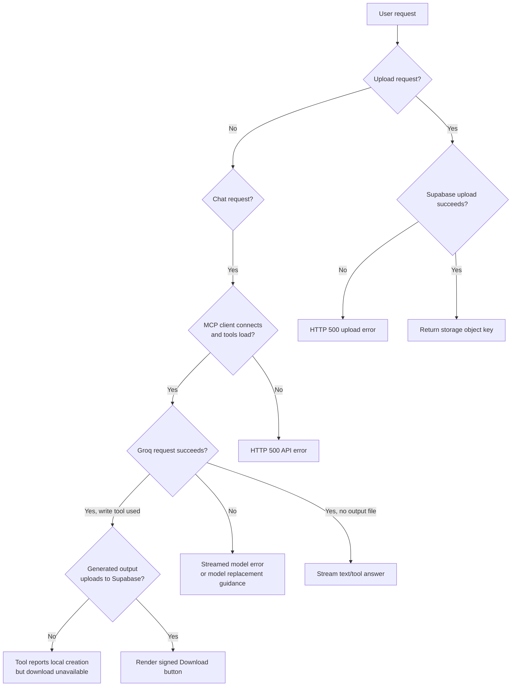

