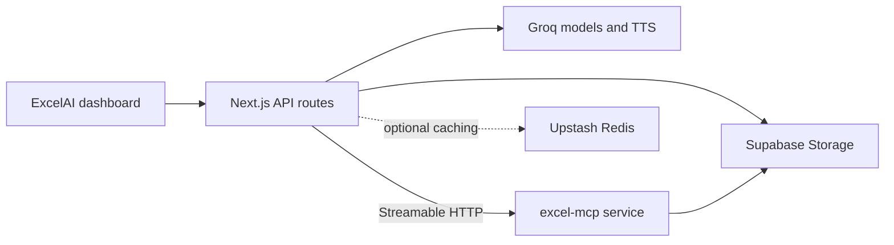

# ExcelAI

ExcelAI is a Next.js application for creating, inspecting, and analyzing Excel
and CSV files through a conversational interface. It uses Groq models for chat
and text-to-speech, a separate [Excel MCP server](https://github.com/Pranoschal/excel-mcp)
for spreadsheet operations, and Supabase Storage to exchange files between the
two services.

## Features

- Upload and analyze `.xlsx`, `.xls`, and `.csv` files.
- Create single-sheet or multi-sheet workbooks from natural-language prompts.
- Read cells and ranges, search and filter rows, aggregate columns, and profile
  datasets.
- Run statistical, correlation, and pivot-table analysis.
- Generate and explain formulas through MCP tools.
- Choose from the chat models currently available through Groq.
- Stream answers, reasoning, and tool results in the dashboard.
- Download generated files through short-lived Supabase signed URLs.
- Optionally read assistant responses aloud with Groq Orpheus TTS.

## How it works



The browser uploads files to the Next.js application, which stores them in
Supabase. Chat requests are sent to Groq with tools discovered from the remote
MCP service. The MCP service downloads source files from the same bucket,
performs spreadsheet operations, and uploads generated files for download.

For component-level diagrams and request flows, see
[Architecture.md](./Architecture.md).

## Prerequisites

- Node.js 20 or newer
- npm
- A [Groq](https://console.groq.com/) API key
- A Supabase project and Storage bucket
- A running
  [`excel-mcp`](https://github.com/Pranoschal/excel-mcp) service
- Optional: an Upstash Redis database for shared caches

## Local setup

### 1. Install ExcelAI

```bash
git clone https://github.com/Pranoschal/ExcelAI.git
cd ExcelAI
npm ci
```

### 2. Configure Supabase

Create a private Storage bucket named `excel-files`, or choose another name and
use it consistently in both repositories. ExcelAI and the MCP service require
the same Supabase project, bucket, and service-role key.

### 3. Configure the MCP service

Clone and start the sibling service by following its
[setup guide](https://github.com/Pranoschal/excel-mcp#local-development).
By default it listens at `http://localhost:5050`.

### 4. Create `.env.local`

Create `.env.local` in this repository:

```env
GROQ_API_KEY=your-groq-api-key
GROQ_DEFAULT_MODEL=

RENDER_MCP_URL=http://localhost:5050

NEXT_PUBLIC_SUPABASE_URL=https://your-project.supabase.co
SUPABASE_SERVICE_ROLE_KEY=your-service-role-key
SUPABASE_BUCKET=excel-files

# Optional distributed caches
KV_REST_API_URL=
KV_REST_API_TOKEN=

# Optional protected keep-warm endpoint
CRON_SECRET=
```

`GROQ_DEFAULT_MODEL` is optional. If it is unset or unavailable, the app selects
an available preferred chat model. Redis is also optional; without it, the app
uses process memory and makes more requests to Groq and the MCP service.

The service-role key is privileged. Keep it server-side and never expose it
through a `NEXT_PUBLIC_` variable.

### 5. Start both applications

Start the MCP service first, then run ExcelAI:

```bash
npm run dev
```

Open [http://localhost:3000](http://localhost:3000) and select **Dashboard**.

## Environment variables

Required:

- `GROQ_API_KEY` — model discovery, chat generation, and TTS.
- `RENDER_MCP_URL` — MCP service base URL, without `/mcp`.
- `NEXT_PUBLIC_SUPABASE_URL` — shared Supabase project URL.
- `SUPABASE_SERVICE_ROLE_KEY` — server-side Storage access.

Optional:

- `GROQ_DEFAULT_MODEL` — preferred Groq model ID.
- `SUPABASE_BUCKET` — Storage bucket; defaults to `excel-files`.
- `KV_REST_API_URL` and `KV_REST_API_TOKEN` — Upstash Redis credentials.
- `CRON_SECRET` — protects `GET /api/cron/keep-mcp-warm`.
- `NEXT_PUBLIC_SUPABASE_ANON_KEY` — used only by the included Supabase helper
  modules; the current dashboard does not use an authentication flow.

## Available scripts

```bash
npm run dev     # Start the development server
npm run build   # Create a production build
npm run start   # Run the production build
npm run lint    # Run the configured Next.js lint command
```

## Deployment

The intended deployment is:

- **Vercel:** this Next.js repository
- **Render or another Node host:** the `excel-mcp` HTTP service
- **Supabase:** shared source and generated files
- **Upstash Redis (optional):** model, MCP tool, and warm-state caches

Set the same production Supabase values in Vercel and the MCP host. Set
`RENDER_MCP_URL` in Vercel to the public MCP base URL, for example
`https://your-excel-mcp.onrender.com`.

The protected keep-warm route is:

```text
GET /api/cron/keep-mcp-warm
Authorization: Bearer <CRON_SECRET>
```

No schedule is defined in the checked-in `vercel.json`; configure Vercel Cron or
another scheduler if you need this route.

## Project structure

```text
app/
  api/chat/                 Groq and MCP orchestration
  api/upload/               Supabase uploads
  api/models/               Groq model discovery
  api/tts/                  Groq speech generation
  dashboard/                Main workspace
ai/                         Model selection and provider setup
components/                 Dashboard and shared UI
hooks/                      Chat, upload, model, and TTS state
lib/                        MCP health/cache, Redis, and Supabase helpers
```

## Operational notes

- Source uploads and generated files are not automatically deleted.
- Generated download links expire after one hour.
- The current API routes do not implement user authentication, rate limiting,
  upload-size limits, or per-user Storage isolation. Add these controls before
  exposing the application publicly.
- Spreadsheet files are processed through Vercel, Supabase, and the MCP host;
  processing is not client-only.